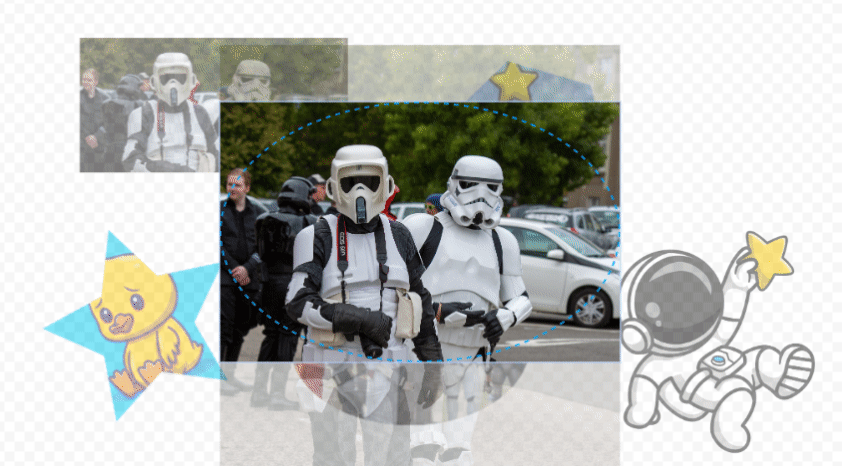

# Molduras com Fabric.js ClipPath 🖼️



[](https://opensource.org/licenses/MIT)
[](https://www.javascript.com/)
[](https://fabricjs.com/)
[](https://getbootstrap.com/)

Uma demonstração interativa da implementação de molduras usando Fabric.js com ClipPath. Crie composições visuais aplicando diferentes formas de molduras às suas imagens com capacidades avançadas de edição.

## ✨ Funcionalidades

- **Formas de Molduras**
  - Básicas: Círculo, Retângulo, Elipse
  - Geométricas: Triângulo, Hexágono
  - Especiais: Estrela, Coração, Nuvem

### Tipos de Molduras Suportados

| Tipo | Código | Descrição |
|------|--------|-----------|
| `'circle'` | Círculo | Moldura circular perfeita |
| `'rect'` | Retângulo | Moldura retangular (padrão) |
| `'ellipse'` | Elipse | Moldura oval |
| `'triangle'` | Triângulo | Moldura triangular |
| `'hexagon'` | Hexágono | Moldura hexagonal |
| `'star'` | Estrela | Moldura em formato de estrela de 5 pontas |
| `'heart'` | Coração | Moldura em formato de coração |
| `'cloud'` | Nuvem | Moldura em formato de nuvem |

- **Edição Avançada de Imagem**
  - Upload de imagem personalizada
  - Modo de edição com duplo clique e recorte avançado
  - Ajuste de recorte em tempo real com controles do mouse
  - Fundo com padrão de tabuleiro para melhor visibilidade
  - Backdrop semi-transparente para visualização completa da imagem
  - Atalhos de teclado (suporte à tecla Delete)

## 🛠️ Tecnologias Utilizadas

- **Fabric.js 5.3.1** - Biblioteca para manipulação de canvas HTML5
- **Bootstrap 5.3.2** - Framework CSS para interface responsiva
- **Bootstrap Icons 1.11.1** - Ícones modernos e consistentes
- **JavaScript ES6+** - Linguagem de programação moderna
- **HTML5 Canvas** - Elemento para renderização gráfica
- **CSS3** - Estilos avançados com animações e transições

## 🚀 Como Usar

### Uso Básico (Interface Web)

1. **Selecionar uma Moldura**: Clique em um dos botões de forma para criar uma moldura
2. **Adicionar Imagem**: Clique em "Adicionar Imagem" ou faça upload do seu próprio arquivo de imagem
3. **Entrar no Modo de Edição**: Clique duplo no grupo moldura+imagem para entrar no modo de edição avançada
4. **Recorte Avançado**: 
   - Arraste a imagem para ajustar a posição do recorte
   - Use as alças dos cantos para redimensionar a área de recorte
   - O backdrop semi-transparente mostra a imagem completa
5. **Sair do Modo de Edição**: Clique duplo na imagem ou clique fora da moldura para sair do modo de edição
6. **Controles Adicionais**:
   - Pressione a tecla `Delete` para remover objetos selecionados
   - Arraste molduras para reposicioná-las e redimensioná-las
   - Gire usando a alça de rotação superior

### Uso Programático (Classe FrameEditor)

```javascript
// Inicializar a classe com um canvas Fabric.js
const canvas = new fabric.Canvas('canvas');
const frameEditor = new FrameEditor(canvas);

// Adicionar diferentes tipos de molduras
frameEditor.addFrame('circle');     // Círculo
frameEditor.addFrame('heart');      // Coração
frameEditor.addFrame('star');       // Estrela
frameEditor.addFrame('hexagon');    // Hexágono

// Fazer upload de imagem
const fileInput = document.getElementById('imageInput');
fileInput.addEventListener('change', (e) => {
    frameEditor.uploadImage(e);
});

// Adicionar imagem por URL
frameEditor.addImage('https://exemplo.com/imagem.jpg');

// Habilitar seleção de imagem para frame ativo
frameEditor.enableToSelectImage();

// Deletar objeto selecionado
frameEditor.deleteObject();
```

### Métodos Principais da Classe

| Método | Descrição |
|--------|-----------|
| `addFrame(type)` | Adiciona um novo frame do tipo especificado |
| `addImage(imageUrl)` | Adiciona uma imagem ao frame ativo |
| `uploadImage(event)` | Processa upload de arquivo de imagem |
| `enterEditMode(e)` | Entra no modo de edição de crop |
| `exitEditMode(e)` | Sai do modo de edição |
| `enableToSelectImage()` | Habilita seleção de imagem para frame ativo |
| `deleteObject(object)` | Remove objeto selecionado do canvas |

## 💻 Tecnologias Utilizadas

- [Fabric.js v5.3.1](http://fabricjs.com/) - Biblioteca de manipulação de canvas
- HTML5 Canvas
- JavaScript ES6+
- CSS3 com design responsivo

## 🔧 Implementação Técnica

### Arquitetura da Aplicação

O projeto utiliza uma **classe JavaScript** (`FrameEditor`) que encapsula toda a funcionalidade de molduras, proporcionando:

- **Código Modular**: Separação clara de responsabilidades e métodos bem definidos
- **Reutilização**: Classe pode ser instanciada múltiplas vezes para diferentes canvases
- **Manutenibilidade**: Código organizado e documentado com JSDoc
- **Extensibilidade**: Fácil adição de novos tipos de molduras e funcionalidades

### Funcionalidades Principais

- **Criação de Molduras**: Formas criadas usando objetos geométricos do Fabric.js com metadados personalizados
- **Sistema ClipPath**: Geração dinâmica de ClipPath para cada tipo de moldura
- **Processamento de Imagem**: Escala e posicionamento automático com preservação da proporção
- **Modo de Edição Avançado**: Edição com duplo clique e ajuste de recorte em tempo real
- **Gerenciamento de Estado**: Bloqueio de objetos e preservação do z-index durante a edição
- **API Orientada a Objetos**: Métodos públicos para controle total da funcionalidade

## 🛠️ Instalação

1. Clone o repositório:
```bash
git clone https://github.com/adrianohcampos/Frames-with-Fabric.js-ClipPath.git
```

2. Navegue até o diretório do projeto:
```bash
cd Frames-with-Fabric.js-ClipPath
```

3. Abra `index.html` no seu navegador web

### Estrutura de Arquivos

```
Frames-with-Fabric.js-ClipPath/
├── index.html          # Interface principal
├── FrameEditor.js      # Código com a Classe FrameEditor
├── script.js           # Código para iniciar instanciar o canva
├── styles.css          # Estilos da aplicação
├── data.json           # Dados de exemplo
└── README.md           # Documentação
```

### Dependências

- **Fabric.js v5.3.1** (carregado via CDN)
- **Navegador moderno** com suporte a ES6+
- **Canvas HTML5** habilitado

### Integração da Classe FrameEditor

Para usar a classe `FrameEditor` em seu projeto:

```html
<!-- Inclua Fabric.js -->
<script src="https://cdnjs.cloudflare.com/ajax/libs/fabric.js/5.3.1/fabric.min.js"></script>

<!-- Inclua a classe FrameEditor -->
<script src="FrameEditor.js"></script>

<script>
// Inicialize o canvas e a classe
const canvas = new fabric.Canvas('meuCanvas');
const frameEditor = new FrameEditor(canvas);

// Use os métodos da classe
frameEditor.addFrame('circle');
</script>
```

## 📄 Licença

Este projeto está sob a licença MIT. Veja o arquivo [LICENSE](LICENSE) para mais detalhes.

## 🤝 Contribuindo

Contribuições são bem-vindas! Sinta-se à vontade para enviar um Pull Request.

---

Desenvolvido com ❤️ usando Fabric.js